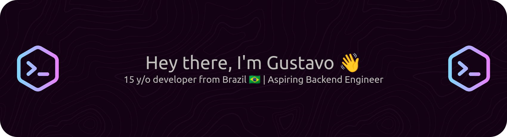

<div align="center">


<svg xmlns="http://www.w3.org/2000/svg"
     viewBox="0 0 1441 302"
     width="1441"
     height="302"
     style="background:#241f31">

    <defs>
        <!-- Glow -->
        <filter id="glow">
            <feGaussianBlur stdDeviation="4" result="blur"/>
            <feMerge>
                <feMergeNode in="blur"/>
                <feMergeNode in="SourceGraphic"/>
            </feMerge>
        </filter>

        <!-- Stronger glow for meteors -->
        <filter id="meteorGlow">
            <feGaussianBlur stdDeviation="3" result="blur"/>
            <feMerge>
                <feMergeNode in="blur"/>
                <feMergeNode in="blur"/>
                <feMergeNode in="SourceGraphic"/>
            </feMerge>
        </filter>

        <!-- Gradient for waves -->
        <linearGradient id="waveGrad" x1="0%" y1="0%" x2="100%" y2="0%">
            <stop offset="0%" stop-color="#613583"/>
            <stop offset="50%" stop-color="#ffffff"/>
            <stop offset="100%" stop-color="#1a5fb4"/>
        </linearGradient>

        <!-- Gradient for glowing circle -->
        <linearGradient id="glowGrad" x1="0%" y1="0%" x2="100%" y2="0%">
            <stop offset="0%" stop-color="#613583"/>
            <stop offset="50%" stop-color="#9a9996"/>
            <stop offset="100%" stop-color="#1a5fb4"/>
        </linearGradient>

        <!-- Meteor trail gradients -->
        

        <!-- Circle clip for avatar -->
        <clipPath id="avatarClip">
            <circle cx="720.5" cy="151" r="45"/>
        </clipPath>
    </defs>

    <!-- Background waves -->
    <path d="M0 151 Q180 121 360 151 T721 151 T1081 151 T1441 151"
          fill="none"
          stroke="url(#waveGrad)"
          stroke-width="2"
          opacity="0.5">
        <animate attributeName="d"
                 dur="6s"
                 repeatCount="indefinite"
                 values="
             M0 151 Q180 121 360 151 T721 151 T1081 151 T1441 151;
             M0 151 Q180 181 360 151 T721 151 T1081 151 T1441 151;
             M0 151 Q180 121 360 151 T721 151 T1081 151 T1441 151"/>
    </path>

    <!-- ========== METEOR LOGOS ========== -->
    

    <image
            href="data:text/html;charset=utf-8;base64,PCFET0NUWVBFIGh0bWw+CjxodG1sPgogIDxoZWFkPgogICAgPG1ldGEgaHR0cC1lcXVpdj0iQ29udGVudC10eXBlIiBjb250ZW50PSJ0ZXh0L2h0bWw7IGNoYXJzZXQ9dXRmLTgiPgogICAgPG1ldGEgaHR0cC1lcXVpdj0iQ29udGVudC1TZWN1cml0eS1Qb2xpY3kiIGNvbnRlbnQ9ImRlZmF1bHQtc3JjICdub25lJzsgc3R5bGUtc3JjICd1bnNhZmUtaW5saW5lJzsgaW1nLXNyYyBkYXRhOjsgY29ubmVjdC1zcmMgJ3NlbGYnIj4KICAgIDx0aXRsZT5QYWdlIG5vdCBmb3VuZCAmbWlkZG90OyBHaXRIdWIgUGFnZXM8L3RpdGxlPgogICAgPHN0eWxlIHR5cGU9InRleHQvY3NzIiBtZWRpYT0ic2NyZWVuIj4KICAgICAgYm9keSB7CiAgICAgICAgYmFja2dyb3VuZC1jb2xvcjogI2YxZjFmMTsKICAgICAgICBtYXJnaW46IDA7CiAgICAgICAgZm9udC1mYW1pbHk6ICJIZWx2ZXRpY2EgTmV1ZSIsIEhlbHZldGljYSwgQXJpYWwsIHNhbnMtc2VyaWY7CiAgICAgIH0KCiAgICAgIC5jb250YWluZXIgeyBtYXJnaW46IDUwcHggYXV0byA0MHB4IGF1dG87IHdpZHRoOiA2MDBweDsgdGV4dC1hbGlnbjogY2VudGVyOyB9CgogICAgICBhIHsgY29sb3I6ICM0MTgzYzQ7IHRleHQtZGVjb3JhdGlvbjogbm9uZTsgfQogICAgICBhOmhvdmVyIHsgdGV4dC1kZWNvcmF0aW9uOiB1bmRlcmxpbmU7IH0KCiAgICAgIGgxIHsgd2lkdGg6IDgwMHB4OyBwb3NpdGlvbjpyZWxhdGl2ZTsgbGVmdDogLTEwMHB4OyBsZXR0ZXItc3BhY2luZzogLTFweDsgbGluZS1oZWlnaHQ6IDYwcHg7IGZvbnQtc2l6ZTogNjBweDsgZm9udC13ZWlnaHQ6IDEwMDsgbWFyZ2luOiAwcHggMCA1MHB4IDA7IHRleHQtc2hhZG93OiAwIDFweCAwICNmZmY7IH0KICAgICAgcCB7IGNvbG9yOiByZ2JhKDAsIDAsIDAsIDAuNSk7IG1hcmdpbjogMjBweCAwOyBsaW5lLWhlaWdodDogMS42OyB9CgogICAgICB1bCB7IGxpc3Qtc3R5bGU6IG5vbmU7IG1hcmdpbjogMjVweCAwOyBwYWRkaW5nOiAwOyB9CiAgICAgIGxpIHsgZGlzcGxheTogdGFibGUtY2VsbDsgZm9udC13ZWlnaHQ6IGJvbGQ7IHdpZHRoOiAxJTsgfQoKICAgICAgLmxvZ28geyBkaXNwbGF5OiBpbmxpbmUtYmxvY2s7IG1hcmdpbi10b3A6IDM1cHg7IH0KICAgICAgLmxvZ28taW1nLTJ4IHsgZGlzcGxheTogbm9uZTsgfQogICAgICBAbWVkaWEKICAgICAgb25seSBzY3JlZW4gYW5kICgtd2Via2l0LW1pbi1kZXZpY2UtcGl4ZWwtcmF0aW86IDIpLAogICAgICBvbmx5IHNjcmVlbiBhbmQgKCAgIG1pbi0tbW96LWRldmljZS1waXhlbC1yYXRpbzogMiksCiAgICAgIG9ubHkgc2NyZWVuIGFuZCAoICAgICAtby1taW4tZGV2aWNlLXBpeGVsLXJhdGlvOiAyLzEpLAogICAgICBvbmx5IHNjcmVlbiBhbmQgKCAgICAgICAgbWluLWRldmljZS1waXhlbC1yYXRpbzogMiksCiAgICAgIG9ubHkgc2NyZWVuIGFuZCAoICAgICAgICAgICAgICAgIG1pbi1yZXNvbHV0aW9uOiAxOTJkcGkpLAogICAgICBvbmx5IHNjcmVlbiBhbmQgKCAgICAgICAgICAgICAgICBtaW4tcmVzb2x1dGlvbjogMmRwcHgpIHsKICAgICAgICAubG9nby1pbWctMXggeyBkaXNwbGF5OiBub25lOyB9CiAgICAgICAgLmxvZ28taW1nLTJ4IHsgZGlzcGxheTogaW5saW5lLWJsb2NrOyB9CiAgICAgIH0KCiAgICAgICNzdWdnZXN0aW9ucyB7CiAgICAgICAgbWFyZ2luLXRvcDogMzVweDsKICAgICAgICBjb2xvcjogI2NjYzsKICAgICAgfQogICAgICAjc3VnZ2VzdGlvbnMgYSB7CiAgICAgICAgY29sb3I6ICM2NjY2NjY7CiAgICAgICAgZm9udC13ZWlnaHQ6IDIwMDsKICAgICAgICBmb250LXNpemU6IDE0cHg7CiAgICAgICAgbWFyZ2luOiAwIDEwcHg7CiAgICAgIH0KCiAgICA8L3N0eWxlPgogIDwvaGVhZD4KICA8Ym9keT4KCiAgICA8ZGl2IGNsYXNzPSJjb250YWluZXIiPgoKICAgICAgPGgxPjQwNDwvaDE+CiAgICAgIDxwPjxzdHJvbmc+RmlsZSBub3QgZm91bmQ8L3N0cm9uZz48L3A+CgogICAgICA8cD4KICAgICAgICBUaGUgc2l0ZSBjb25maWd1cmVkIGF0IHRoaXMgYWRkcmVzcyBkb2VzIG5vdAogICAgICAgIGNvbnRhaW4gdGhlIHJlcXVlc3RlZCBmaWxlLgogICAgICA8L3A+CgogICAgICA8cD4KICAgICAgICBJZiB0aGlzIGlzIHlvdXIgc2l0ZSwgbWFrZSBzdXJlIHRoYXQgdGhlIGZpbGVuYW1lIGNhc2UgbWF0Y2hlcyB0aGUgVVJMCiAgICAgICAgYXMgd2VsbCBhcyBhbnkgZmlsZSBwZXJtaXNzaW9ucy48YnI+CiAgICAgICAgRm9yIHJvb3QgVVJMcyAobGlrZSA8Y29kZT5odHRwOi8vZXhhbXBsZS5jb20vPC9jb2RlPikgeW91IG11c3QgcHJvdmlkZSBhbgogICAgICAgIDxjb2RlPmluZGV4Lmh0bWw8L2NvZGU+IGZpbGUuCiAgICAgIDwvcD4KCiAgICAgIDxwPgogICAgICAgIDxhIGhyZWY9Imh0dHBzOi8vaGVscC5naXRodWIuY29tL3BhZ2VzLyI+UmVhZCB0aGUgZnVsbCBkb2N1bWVudGF0aW9uPC9hPgogICAgICAgIGZvciBtb3JlIGluZm9ybWF0aW9uIGFib3V0IHVzaW5nIDxzdHJvbmc+R2l0SHViIFBhZ2VzPC9zdHJvbmc+LgogICAgICA8L3A+CgogICAgICA8ZGl2IGlkPSJzdWdnZXN0aW9ucyI+CiAgICAgICAgPGEgaHJlZj0iaHR0cHM6Ly9naXRodWJzdGF0dXMuY29tIj5HaXRIdWIgU3RhdHVzPC9hPiAmbWRhc2g7CiAgICAgICAgPGEgaHJlZj0iaHR0cHM6Ly90d2l0dGVyLmNvbS9naXRodWJzdGF0dXMiPkBnaXRodWJzdGF0dXM8L2E+CiAgICAgIDwvZGl2PgoKICAgICAgPGEgaHJlZj0iLyIgY2xhc3M9ImxvZ28gbG9nby1pbWctMXgiPgogICAgICAgIDxpbWcgd2lkdGg9IjMyIiBoZWlnaHQ9IjMyIiB0aXRsZT0iIiBhbHQ9IiIgc3JjPSJkYXRhOmltYWdlL3BuZztiYXNlNjQsaVZCT1J3MEtHZ29BQUFBTlNVaEVVZ0FBQUNBQUFBQWdDQVlBQUFCemVucjBBQUFBR1hSRldIUlRiMlowZDJGeVpRQkJaRzlpWlNCSmJXRm5aVkpsWVdSNWNjbGxQQUFBQXlScFZGaDBXRTFNT21OdmJTNWhaRzlpWlM1NGJYQUFBQUFBQUR3L2VIQmhZMnRsZENCaVpXZHBiajBpNzd1L0lpQnBaRDBpVnpWTk1FMXdRMlZvYVVoNmNtVlRlazVVWTNwcll6bGtJajgrSUR4NE9uaHRjRzFsZEdFZ2VHMXNibk02ZUQwaVlXUnZZbVU2Ym5NNmJXVjBZUzhpSUhnNmVHMXdkR3M5SWtGa2IySmxJRmhOVUNCRGIzSmxJRFV1TXkxak1ERXhJRFkyTGpFME5UWTJNU3dnTWpBeE1pOHdNaTh3TmkweE5EbzFOam95TnlBZ0lDQWdJQ0FnSWo0Z1BISmtaanBTUkVZZ2VHMXNibk02Y21SbVBTSm9kSFJ3T2k4dmQzZDNMbmN6TG05eVp5OHhPVGs1THpBeUx6SXlMWEprWmkxemVXNTBZWGd0Ym5NaklqNGdQSEprWmpwRVpYTmpjbWx3ZEdsdmJpQnlaR1k2WVdKdmRYUTlJaUlnZUcxc2JuTTZlRzF3UFNKb2RIUndPaTh2Ym5NdVlXUnZZbVV1WTI5dEwzaGhjQzh4TGpBdklpQjRiV3h1Y3pwNGJYQk5UVDBpYUhSMGNEb3ZMMjV6TG1Ga2IySmxMbU52YlM5NFlYQXZNUzR3TDIxdEx5SWdlRzFzYm5NNmMzUlNaV1k5SW1oMGRIQTZMeTl1Y3k1aFpHOWlaUzVqYjIwdmVHRndMekV1TUM5elZIbHdaUzlTWlhOdmRYSmpaVkpsWmlNaUlIaHRjRHBEY21WaGRHOXlWRzl2YkQwaVFXUnZZbVVnVUdodmRHOXphRzl3SUVOVE5pQW9UV0ZqYVc1MGIzTm9LU0lnZUcxd1RVMDZTVzV6ZEdGdVkyVkpSRDBpZUcxd0xtbHBaRHBGTVRaQ1JEWTNSRUl6UmpBeE1VVXlRVVF6UkVJeFF6UkVOVUZGTlVNNU5pSWdlRzF3VFUwNlJHOWpkVzFsYm5SSlJEMGllRzF3TG1ScFpEcEZNVFpDUkRZM1JVSXpSakF4TVVVeVFVUXpSRUl4UXpSRU5VRkZOVU01TmlJK0lEeDRiWEJOVFRwRVpYSnBkbVZrUm5KdmJTQnpkRkpsWmpwcGJuTjBZVzVqWlVsRVBTSjRiWEF1YVdsa09rVXhOa0pFTmpkQ1FqTkdNREV4UlRKQlJETkVRakZETkVRMVFVVTFRemsySWlCemRGSmxaanBrYjJOMWJXVnVkRWxFUFNKNGJYQXVaR2xrT2tVeE5rSkVOamREUWpOR01ERXhSVEpCUkRORVFqRkRORVExUVVVMVF6azJJaTgrSUR3dmNtUm1Pa1JsYzJOeWFYQjBhVzl1UGlBOEwzSmtaanBTUkVZK0lEd3ZlRHA0YlhCdFpYUmhQaUE4UDNod1lXTnJaWFFnWlc1a1BTSnlJajgrU005TUNBQUFBKzVKUkVGVWVOckVWMTFJazFFWTNzNCtkZE9wMjlRNWIwb3BDZ0tGc29Lb2k1S2c2Q0lodXdpNnpMSkxvWUxvcHE0cXNLS2dpNGk2Q1lJb1UvcTVpREFLczZzeW9TNzZJUld0eUorcDdjZHQ3c2YxUEdPRCtlMGMzZHlnQXgvNjdaenpQTTk1Lzg3N0dZZEhSZzNaak1YRnhlcFFLTlM2c0xDd0p4cU5OdUZwaU1malZzNFpqVWEvcG1tamVENlZsSlM4TnB2TlQ0UVE3bXh3alNzSmlFUWltLzErLzlsZ01IZ0lyNW9odXhHMVdDdzlWcXYxY2xGUjBkQ3FCT0RFbFY2djkwb2dFRGpHZFliVmpYaHBhZW5kaW9xSzA3Q0lSN1pBcUU0OVBUMDlCUEwyUE1nVEJ5UUdzWWlabFFENHVNWHRkcitKeFdJTmhnSU5ZaEdUMk1zS2dNcm0yZG5aWGdSWGhhSEFnNWpFSm9kVUFIeHV4NEx1ZEhKRTlSZEVkQStpM0p1ejdiR0hlNG1oRTlGTnJnd0JDTGlyTUZWOU9raDVlZmxGaDhQUjVuSzVuRGFiclIyQk5KbEtPMFQzNStMaTRuNCsvSisvSlFDeGhtdTVoM3VKb1hOSFBibVdaQUhNc2hXQjhsNS9pcHFhbW1hQWYwelBERHgxT05WM3Z1cmRpZHF3QVFMK3BFYzhzTGNBZTFDQ3ZRM1lIeElXOFBsODV4U1dOQzFoQURESXYwcklFL280SjBrM2t3dzR4U2x3SWhjcTNFRkZPbTdLTi9oVUdPUWt0MENGYTVXcE5KbE12eEJFei9JVlFBeGcvWlJabDl3aUhBNjN5RFlpZU03RG5MUDVDaUFHc0M3STVzZ3RZS0pHV2UyQThzZUZxZ0ZKckpqRVBZMUNuM3BKOC85VzFlNVZXc0ZEVEVtRnJCY29EaFpKRVFrWHVoSUNNeUtwamhhaHFOMjFoUllBVEtmVU9sRG1reWdyUjRvNEMwVk9MR0pLck9JVEtCNGppanpkWHlnQktpeHlDNVREUWRuay9QejhxUnc2b09XR2xzVEtHT1FXNk9INkZCV3N5ZVB4ZE9YTFRneGl5ZWJJTFpDanorR0xnTUlLblhOemM0OVlNbGNSZEhYY1N3eEZWZ1RJblFoQzlHMzNVaE5vSkx1cXE2dDM0NXA5eTNlVXk4T1RrNVBqQUh1STl1bzRiMDdGQmFPaHN1MEE0VW5jK1QxVFUxTmozS3NTU0U1eUo2NWpxRjJERGQ4UXFXWW1BWnJJTTJWbFpUZG5abWI2QWJwZFY5VjZlYzl6bmY1UTdIall1bWRSRTBKT3AzTWppdE80U0ZhK2NaejhVbXFlM1RDYlNMdmRma1Iva1dEZE5RbDVJbnVUY3lzT2NwRlQzNVpyYkJ4eDRwM0pBSGxaVlZXMUQvNjM0VlJ0K0Z2TEJnSy92NUxWOVdTKzEweE1URXd0Unc3WHZxT0wrZTJROFYzQVlJT0lBWFEyNi9oZVdWblpDVmZjeUtIZzJDQmdUcG1QbWpZTThsMjRHeWFVSHlhSWg3WHdmUjlFckU4cUhvRGZuMkxUTkFWQzBIWDZNRmNCSVA4QmkrNkY2Y2RXL0RJQ2tBTlJmeDk5ZkVZRlE3TnBoNWkvdVFpQTIxNGdubzdLK2d1aGFpS2c5Z0M2MitNOGVSN1hzQnNZSjRpbGFtNjBGYjdyN3VBajh3Rnl1d00xb0lPV2dmbUR5NlJYRUVRekpNUGUyM0RYclZTN3J0eUQzRGY4ei9GUGdBRUF6V1U1S3U1OVpBVUFBQUFBU1VWT1JLNUNZSUk9Ij4KICAgICAgPC9hPgoKICAgICAgPGEgaHJlZj0iLyIgY2xhc3M9ImxvZ28gbG9nby1pbWctMngiPgogICAgICAgIDxpbWcgd2lkdGg9IjMyIiBoZWlnaHQ9IjMyIiB0aXRsZT0iIiBhbHQ9IiIgc3JjPSJkYXRhOmltYWdlL3BuZztiYXNlNjQsaVZCT1J3MEtHZ29BQUFBTlNVaEVVZ0FBQUVBQUFBQkFDQVlBQUFDcWFYSGVBQUFBR1hSRldIUlRiMlowZDJGeVpRQkJaRzlpWlNCSmJXRm5aVkpsWVdSNWNjbGxQQUFBQXlScFZGaDBXRTFNT21OdmJTNWhaRzlpWlM1NGJYQUFBQUFBQUR3L2VIQmhZMnRsZENCaVpXZHBiajBpNzd1L0lpQnBaRDBpVnpWTk1FMXdRMlZvYVVoNmNtVlRlazVVWTNwcll6bGtJajgrSUR4NE9uaHRjRzFsZEdFZ2VHMXNibk02ZUQwaVlXUnZZbVU2Ym5NNmJXVjBZUzhpSUhnNmVHMXdkR3M5SWtGa2IySmxJRmhOVUNCRGIzSmxJRFV1TXkxak1ERXhJRFkyTGpFME5UWTJNU3dnTWpBeE1pOHdNaTh3TmkweE5EbzFOam95TnlBZ0lDQWdJQ0FnSWo0Z1BISmtaanBTUkVZZ2VHMXNibk02Y21SbVBTSm9kSFJ3T2k4dmQzZDNMbmN6TG05eVp5OHhPVGs1THpBeUx6SXlMWEprWmkxemVXNTBZWGd0Ym5NaklqNGdQSEprWmpwRVpYTmpjbWx3ZEdsdmJpQnlaR1k2WVdKdmRYUTlJaUlnZUcxc2JuTTZlRzF3UFNKb2RIUndPaTh2Ym5NdVlXUnZZbVV1WTI5dEwzaGhjQzh4TGpBdklpQjRiV3h1Y3pwNGJYQk5UVDBpYUhSMGNEb3ZMMjV6TG1Ga2IySmxMbU52YlM5NFlYQXZNUzR3TDIxdEx5SWdlRzFzYm5NNmMzUlNaV1k5SW1oMGRIQTZMeTl1Y3k1aFpHOWlaUzVqYjIwdmVHRndMekV1TUM5elZIbHdaUzlTWlhOdmRYSmpaVkpsWmlNaUlIaHRjRHBEY21WaGRHOXlWRzl2YkQwaVFXUnZZbVVnVUdodmRHOXphRzl3SUVOVE5pQW9UV0ZqYVc1MGIzTm9LU0lnZUcxd1RVMDZTVzV6ZEdGdVkyVkpSRDBpZUcxd0xtbHBaRHBFUVVNMVFrVXhSVUkwTVVNeE1VVXlRVVF6UkVJeFF6UkVOVUZGTlVNNU5pSWdlRzF3VFUwNlJHOWpkVzFsYm5SSlJEMGllRzF3TG1ScFpEcEVRVU0xUWtVeFJrSTBNVU14TVVVeVFVUXpSRUl4UXpSRU5VRkZOVU01TmlJK0lEeDRiWEJOVFRwRVpYSnBkbVZrUm5KdmJTQnpkRkpsWmpwcGJuTjBZVzVqWlVsRVBTSjRiWEF1YVdsa09rVXhOa0pFTmpkR1FqTkdNREV4UlRKQlJETkVRakZETkVRMVFVVTFRemsySWlCemRGSmxaanBrYjJOMWJXVnVkRWxFUFNKNGJYQXVaR2xrT2tVeE5rSkVOamd3UWpOR01ERXhSVEpCUkRORVFqRkRORVExUVVVMVF6azJJaTgrSUR3dmNtUm1Pa1JsYzJOeWFYQjBhVzl1UGlBOEwzSmtaanBTUkVZK0lEd3ZlRHA0YlhCdFpYUmhQaUE4UDNod1lXTnJaWFFnWlc1a1BTSnlJajgraGZQUmFRQUFCNmxKUkVGVWVOcnNXMm1NRTJVWWJvZHR0KzIyMjJ1MzVRaGVvQ0NZR0JRbGlnSUpna1pKTlB6Z2lnb2FURWo4QWRGRU1mQURmeUFCa2dXaWlXY2llSzRTK1FPaUhBWVVqMmhNTktnWWxFdWpwTnR0dTl2dHRidmR3K2NoVTFLNk01MzVwdDN1YkhDU3llelIrYjczZWI3Myt0N3ZyZlhzdWZPVzRiejYrdm9tOS9iMjNvdm5OTnczNGI1eFlHQWdPRGc0Nk1idDRtZXNWbXNXZDFxU3BIaGRYZDJmdVAvQWZjcHV0NS9BODh4d3ltY2RCZ0xxZW5wNkZ1Unl1V1Y0enUvdjc1OVF5V0JqeG96NXQ3NisvZ3VuMDltSzV4Rnlha29DQVBTYVRDYXpOcHZOUG9ZVmJoNk8xWUtHUkYwdTEzc05EUTI3UU16ZnBpQUFLajBsblU2L2dCVmZBWlcyV1dwd3dWenkwSWdQM0c3M0Zwakk2UkVoQUdBOXFWUnFBMWI5bVZvQlZ5SUMydERpOFhnMjQrZFV6UWlBYlMvczdPeDhHMm8vM21LQ0MrWncwZWZ6UFFFZmNWallyQVJYM2RiVjFiVXRIbzhmTWd0NDJmK01wMHlVVFZRYmRXc0FIVnNpa2RpSGtIYVB4Y1FYUXVmWGdVQmdNUnhtZTlVMEFBeGZINHZGdmpNN2VGNlVrYkpTNXFvUXdFUUdBNTdBYzVKbGxGeVVWWlo1Y2tVRWdNVnhzSzJqbFNZekkrUVhKc2l5anpORUFKeUpBemIvS1FhNDFqSktMOHBPRE1RaVRFQXltWHc1bjgvUDBJakQzYmg3UmdvZzU5YWFueGlJUlRWdlYvb2owdG5IY2EvV01yVndPRHdCM3JhVEd4emtCZy9nblpWYXBGVjYyV3kybjVBTzcwSE0vNXdiSjBRblh5UVNhVlBESXVOWnpZMFYzbnRITXd4aXdIQTBHajJOcDdlY0lCRGdhREFZWEtDUUpNMURocmdKM25odWxjUGJsOGo0Tm1IZTQ2WC9nNjBmd2J6M2Fld2prcUZRYUFxZWJXVTFBT3F5UXd0OElkNnFFSE1jOTd6dTd1N0ZHR3NuN0hBaVZ1b3NWdzdQMzVDMW5jY2RnU0N4b3AxZEhlWnN3bWZITW54Qm82WlRrK2pOOGRsL3ZGN3ZXb2ZEc2ErTUxOOW9FVUJNeE9iMysxZW9Fc0JWdzZabXVhNDlyOFltaEFLRGlFUGNNd0JzeE1pcVEraXh6UEZ4WnlxUnBYQVJHL1lPcjFPYkZKMGdVc2tYQmJhbWNSMU9LbU1VdkR4SFJBdTgvTG1ZM2pGTE1VcEZxejlIeEc2NXNtWUpkeUt5RUNPeERpRUFlL3AxZ2pGMm9vbml2WkFzeFZnbDJkYWE0RVFXQ1c2SjU1cUZBRkZaaUpXWUx4TlF5MnFPU1V6R1JzeVhDVURJZWxpd0FIRU80V1NsV1FCUkZvWmFrWGNLbUNYbXlYQUtzMFZlOXZsOHE0MldvSVlwSlU0aFYzaEtjTnM4bTlnbDdwL3hRNzNlRjVrQjRqNW1OcldtVEpSTndBenFpVjFDeGpWVFpDSWtFcStaMWJaRlpTTjJDZW5tVkFGVnk0UGx6OHhLQUdXampBS0ZrNmxDQk1EUi9NSmpMTE1TUU5tNDN4QWlRS1RhQSs5L3dld2hEakwrSlZJMWtrVFNTT1RjS2JNVHdQcUVTQW90NmRuNkZyMWdId1ZKanU2SVJ1eWlCeVB1VVVCQWc1REdrQWdCbXhsdmRnSUVLOWdEa29oZFkvQkpvNENBRzBSOG1pUlNzR0FCa2dWUXM0S1h1MDk4SWdVWFNTUnNGQW9LWmlWQVZEWTJXVWlpUFRqWVJpNDFLd0dpc3JHc0x0bHN0aDhGaXduejJmQmtRdldmUnRsRTNpRjJ5VzYzL3lDYWNYWjFkVzAyR3dHeVRGYVJkNGlkSm5DS0hSYUN4WVJIb0c1TFRLVDZTeWlUb1AxZkpIYm1BWVBZUlIwVW5aUXRNbkE2czB6ZytHWkJsdDBHZG83RVBIZ3BFM1E2blo4WXlMaGM4WGo4TUpoL2FLVEFZKzVGUEFLSExFN1Jkd3VZSlptTnd6eUNNa0JDWXlLUk9KQk1KbDlCL1BYWENqam1DbURPVnpIM2ZpUHBPYkVXR3FvS2U0RUJsOHYxaGxxc2RMdmQyM21reEhNOXBjOWtNcG1ubzlIb2VUaWk3ZXdiSEVaUFB4MXp0TFMxdFYzQW5HdU1qaU5qdmJRRnVIdzZ6RG81Qnk3ZFRQQVFOQmdNTHJSYXJUa1NsczFtbndUN3V3cDl2aXJ4OVF6YlcvSHVWL2o1ZC9iKzZqbmlLbGxsUDhsa2VPTkpEaytkcTlHc1FUbkM0ZkIxaGVPMEs0N0h3ZTdXZERyOW5BS2dYd09Cd0hJK0M0NUh0ajFkNnNkNDI5VFVORWNtVWRjK1BSYUxIY3ZuODdkWFc0dWd6ZHNhR3h1Zkw5NE5Gdjl6aTFKN0dWYmhsdmIyZG5hSjNTVnJ4ZmMrbjIrTlRzWjcvSDcvTXIzZzVYZFNJSHlKU0gxUForN2ZUb3lsMitFcnFpbGdaNE5hTFlCOWdvVkdhSGpSOTNIdjFaclU0WERzRlQyMGtIM1BPYnpiV2swQ2dHMWphY1ZJVW5BUWI5RitWZXh5TE16a3BjTHYwSUpWN0FIUUlPQ0FVWUh4N3Y1cWdTY21ZSHRUcVNBeVpMRUpUSzIyQmllNGlxM3hzcXBtNFNBZjlIcTlhMkRuSjR1TEszU0VVTGNkUnZwM2kzekh5U3FwZmljeEVkc1FjMU5ybFlYWHZSK083cUFTU2V6WEIraDFTdVVvbWdnOUxMOEJVb1Y0NzQ5RUlvbEtoK0VpcVdtcVZFWmxEZ0hrczJweEh3N3hUcVVRdzlKNU5jQVhPSzEwQUdJb1o2WmxpNkpZNloxUTQ2MUtvWjROaUtMSGFyVytLRHN4bERVUEhaNXpQUVpxVVZEUEpzVHFiNW45bWFsYnBBaDhDMlhYRExsNjIrV1pJREZSVWxOVk9pd2VuY25OVTNhUUVrTCtjRE1Tb0x2Wm8yZlFCN0FKc3NOQXVGdXZvcmxEVlZra2cySTg3K2pvMksyUUFWcGhEcmZ5VmlLNVZxdE8zNE9rYXhYQ3ArN2RyZERCQ0FkdWJtNmVpZFgrMld3cVQ1a29td2g0WVFMaytINGFFOTNoOFhnMmd2SGVrUVpPR1NnTFpUTHlEVExKNEx4OS9LWldLQlNhaW5UNEl5M0ZxUUJmblVaUjQyUEtRRmtzQnI5UUtWWENQdXNEM09pQS9Sa1E1a1A4cVYvSmwxV3l3QXAvNitkY21QTTJ6TDFVclVhaGU0SnFmbldXS1hJdWwzdVViZlA4bmpBRkxXMU9GcjNnZEZ0WjcyY05IK1B0UVQ3L2JyVytOWHFKQUhoMHk5VjgvVS9BMVU3QWZ3SU1BRDdtUzNwQ2J1V0pBQUFBQUVsRlRrU3VRbUNDIj4KICAgICAgPC9hPgogICAgPC9kaXY+CiAgPC9ib2R5Pgo8L2h0bWw+Cg=="
            x="675.5" y="106"
            width="90" height="90"
            clip-path="url(#avatarClip)"
            preserveAspectRatio="xMidYMid slice" />

    <circle cx="720.5" cy="151" r="45"
            fill="none"
            stroke="url(#glowGrad)"
            stroke-width="3"
            filter="url(#glow)">
        <animate attributeName="r"
                 values="40;50;40"
                 dur="2.5s"
                 repeatCount="indefinite"/>
        <animate attributeName="opacity"
                 values="0.6;1;0.6"
                 dur="2.5s"
                 repeatCount="indefinite"/>
    </circle>

    <g transform="translate(720.5 151)">
        <circle cx="0" cy="0" r="60"
                fill="none"
                stroke="url(#glowGrad)"
                stroke-width="2"
                stroke-dasharray="6 4"
                filter="url(#glow)">
            <animateTransform
                    attributeName="transform"
                    type="rotate"
                    from="0"
                    to="360"
                    dur="10s"
                    repeatCount="indefinite"/>
        </circle>
    </g>

    <!-- Floating particles -->
    <g fill="#9141ac" opacity="0.8">
        
        <circle cx="144" cy="242" r="2">
            <animate attributeName="cy" values="242;60" dur="5s" repeatCount="indefinite"/>
            <animate attributeName="opacity" values="0;1;0" dur="5s" repeatCount="indefinite"/>
        </circle>
        <circle cx="389" cy="76" r="2">
            <animate attributeName="cy" values="76;272" dur="6s" repeatCount="indefinite"/>
            <animate attributeName="opacity" values="0;1;0" dur="6s" repeatCount="indefinite"/>
        </circle>
        <circle cx="144" cy="242" r="2">
            <animate attributeName="cy" values="242;60" dur="7s" repeatCount="indefinite"/>
            <animate attributeName="opacity" values="0;1;0" dur="7s" repeatCount="indefinite"/>
        </circle>
        <circle cx="775" cy="76" r="2">
            <animate attributeName="cy" values="76;272" dur="5s" repeatCount="indefinite"/>
            <animate attributeName="opacity" values="0;1;0" dur="5s" repeatCount="indefinite"/>
        </circle>
        <circle cx="492" cy="242" r="2">
            <animate attributeName="cy" values="242;60" dur="6s" repeatCount="indefinite"/>
            <animate attributeName="opacity" values="0;1;0" dur="6s" repeatCount="indefinite"/>
        </circle>
        <circle cx="773" cy="76" r="2">
            <animate attributeName="cy" values="76;272" dur="7s" repeatCount="indefinite"/>
            <animate attributeName="opacity" values="0;1;0" dur="7s" repeatCount="indefinite"/>
        </circle>
        <circle cx="1124" cy="242" r="2">
            <animate attributeName="cy" values="242;60" dur="5s" repeatCount="indefinite"/>
            <animate attributeName="opacity" values="0;1;0" dur="5s" repeatCount="indefinite"/>
        </circle>
        <circle cx="800" cy="76" r="2">
            <animate attributeName="cy" values="76;272" dur="6s" repeatCount="indefinite"/>
            <animate attributeName="opacity" values="0;1;0" dur="6s" repeatCount="indefinite"/>
        </circle>
        <circle cx="1297" cy="242" r="2">
            <animate attributeName="cy" values="242;60" dur="7s" repeatCount="indefinite"/>
            <animate attributeName="opacity" values="0;1;0" dur="7s" repeatCount="indefinite"/>
        </circle>
        <circle cx="1229" cy="76" r="2">
            <animate attributeName="cy" values="76;272" dur="5s" repeatCount="indefinite"/>
            <animate attributeName="opacity" values="0;1;0" dur="5s" repeatCount="indefinite"/>
        </circle>
    </g>

    
</svg>


<br/>

[](https://git.io/typing-svg)

</div>

---

## 🛠️ Current Skills

<div align="center">


</div>

## 🧑‍💻 About Me

- 🎓 High school student with a serious passion for technology
- 🔧 Currently diving deep into **Backend Development**
- 🐧 Linux enthusiast — the terminal is my comfort zone
- 🤖 Experimenting with automation workflows using **n8n**
- 📚 Always learning something new, every single day
- 🌎 Based in **Brazil** | Intermediate English speaker

## 💡 Interests

I'm really into backend systems — APIs, servers, databases, how everything connects behind the scenes. Linux is basically my home at this point. I also love automating stuff with n8n and scripts, making boring tasks just disappear. Oh, and I casually find cybersecurity fascinating — not planning to go into it professionally, I just think it's super cool to understand how things can be broken and protected.

---


---

## 🚀 Learning Roadmap

```
✅ HTML & CSS          — Done
✅ Linux basics        — Done
🔄 n8n automation      — In progress
⏳ C#                  — Next up
⏳ C++                 — Next up
⏳ REST APIs           — Planned
⏳ Databases (SQL)     — Planned
⏳ Docker              — Planned
```

---

## 🎯 Goals

- [ ] Build my first complete backend API from scratch
- [ ] Contribute to an open source project
- [ ] Learn C# and create a real-world application
- [ ] Understand how systems work under the hood (OS, networking, memory)
- [ ] Land my first developer role or internship

---


---

## 🌐 Connect With Me

<div align="center">

[](https://www.instagram.com/rocgust_btw?igsh=cDVodzFlN3V2aXR1)
[](mailto:gustavomocha@proton.me)

</div>

---

<div align="center">

"


*"The expert in anything was once a beginner."*

⭐ If you find any of my projects useful, feel free to leave a star!

</div>
